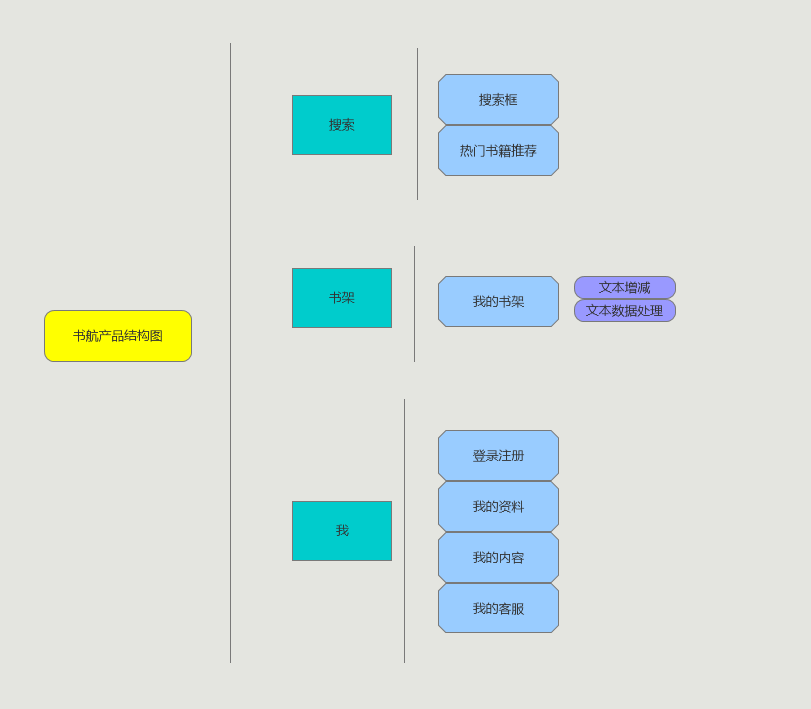

# app项目名称
  书航

## 文本范围
除报纸书刊外的出版书籍，包括各类论文，期刊。

## 背景
随着互联网时代的发展，文本也充斥着互联网，但是又不能确定其来源，虽然搜索引擎的发展，一些经典语句只要搜索一下就能够找到来源了，可是那些不是非经典，或者一长段的语句，就很难找得到源头。而且呈现这些文本的形式很可能是图片，这又为搜索增添了难度，一个能够便于人们找寻文本来源的app就能够解决这些问题。而且经过调查，目前中国市场上没有同类产品，即无论文本用什么形式呈现都能够进行快速到位搜索到来源的app。
除此之外，互联网也增加了人们对于文本的处理要求，虽然有一些电脑办公软件自带有简单数据处理的能力，如office办公软件，但是不够智能，不能够列举清楚重复词语所在的位置，也不能够确定词语的语义。而且经过调查，在中国市场上没有同类产品，即可以在文本内部进行简易文本处理的app。

## 价值主张（目的）
让每个人更了解文本的来源以及文本的结构。

## 目标：
- 前期目标：
1. 获得各大书本版权方的合作，建立一个足够庞大的文本数据库。
2. 提供简洁有效的文本处理工具。
3. 能够让使用者找到文本的来源。
4. 实现便捷的文本输入与识别。

- 后期目标（暂时不做）：
1. 将文本数据库扩大到各类书籍与论文。
2. 更加便捷的文本输入与识别。
3. 更加准确的指出的文本来源。
4. 实现不同文本之间的对比，而不是仅是在文本内部。
5. 实现更加精细复杂的文本处理对比功能。

## 核心功能（最小可行性产品）
通过搜索你提供的截选文本，来得出截选文本的归属，并且能够进行简单的数据处理。（如搜索截选文本的重复次数，整体文本的最高频使用词。）

## 目标用户
各类书迷，汉语言专业学生，文学学者，需要确认文本的出处的人，需要对文本进行简单数据处理的人。

## 用户痛点
场景一：刷微博的时候，看到一段很有意思的话，想知道来自哪里，怎么查又查不到。

我们要怎么样才能够找到这些文本的来源？

场景二：看到一句话在好多个地方被提及，想知道这句话到底被用了多少次，又用在了哪里。

一个一个找难道不麻烦吗？

场景三：别人说了一句话，说是鲁迅说的，但是真的是鲁迅说的吗？我要怎么样才能够知道呢？

怎么样才可以知道到底这个截选文本归属于谁呢？

## 具体使用场景
| 用户案例	| 对应标题	| 重要程度 |
| -- | -- | -- |
| 用户想知道文本的来源？	| 文本来源 	| 重要 |
| 用户想要对文本进行数据处理	| 数据处理	| 重要 |
| 用户想要确认文本的出处 | 文本来源 | 重要 |

用户案例1 小明在微博上看见别人发了几张小说故事的图片，他觉得很有意思，想知道这个小说到底是什么，问人还要等，可他现在就想要知道，他打开书航app，将图片上传搜索，马上就找到了这本小说的名字叫什么。

用户案例2 小林是个在读的汉语言大学生，他平时的作业都是要求解读文本的内容，有时候他想看看文本里面的重复用词到底怎么样，短篇小说虽然可以一个一个找，但是长篇的可要怎么办？小林在网上找到了书航app，只要把文本上传到app上，就能够进行这些重复用词的查找，而且还能够选择显示模式，看这些重复用词的前后用语。

用户案例3 小王在刷微博时，看见别人发了好多名言，然后都说是鲁迅说的，他觉得好像不是这样，但是又要怎么确认鲁迅说过还是没说过呢？小王打开在书航app上输入了这些说是鲁迅说的名言，发觉有一些根本就找不到出处，而有一些则是别的著名作家说的。

## 文本来源搜索的实现方式（设想）：
#### 数据库
文本数据库的建立是文本来源搜索的第一步，其次是要将文本数据库不断扩大，包囊各式各样的文本。
#### 模糊搜索
通过机器学习等，实现用户输入模糊文本时，也能够得出准确结果。

## 数据处理的实现方式（设想）：
#### 智能数据处理：
1. 通过对文本的分析得出一个词库图，词库图中包含的内容为，文本中出现次数最频繁的排名前五的词语以及出现次数最少的后三位的词语。
2. 通过词性分析，得出文本的各种词性的数量，并将其数据可视化为条形图或圆饼图。
3. 通过词向量分析，得出文本词语空间分布图，来呈现该文本的用词偏爱等。
#### 自定义数据处理：
主要区别在于用户可以自己选择文本的范围，并且能够选择显示的图形，以及重复用词的所在位置。
## Api加值宣言
#### 搜索与输入
- 采用通用文字识别Api，便捷识别图片中的文字，提高使用者搜索效率，减少使用者的输入问题
- 采用短语音文字识别Api，并可根据句意自动纠错、自动断句添加标点，让输入更快捷，减少搜索输入时间。
#### 文本数据处理
- 采用词向量表示api，将语言词表中的词映射成一个长度固定的向量，词表中所有的词向量构成一个向量空间，来探究文本的表达倾向。
- 采用词法分析api，来显示文本中词性比例，语法用意。
## 产品结构图
1. 产品功能结构图

2. 产品信息结构图

3. 产品流程图

4. 产品结构图

## 原型
#### 使用者交互与设计（axure产品原型）

- [原型文档展示](http://nfunm048.gitee.io/api_final_axsure/#g=1&p=1_%E6%90%9C%E7%B4%A2%E9%A1%B5)

- [原型文档下载区](https://gitee.com/NFUNM048/api_final_axsure)

#### 交互及界面设计
- 1.搜索页
- 1.1图片搜索
- 1.2语音搜索
- 1.3双击搜索框
- 2.书架页
- 2.1数据处理页
- 2.2自定义数据处理页
- 2.3处理结果页示范
- 3.我页

## 产品的可行性:
1. 该产品是个app，体量大小预计适中，不会占据太多储存空间。
2. 该产品有针对的目标用户群体，读书爱好者，文本研究者，汉语言学生。
3. 该产品有核心功能和辅助功能，解决了用户想要寻找文本来源和进行简单数据处理的问题。
4. 该产品在数据分析方面有较大的发展潜力，能够不断添加功能，吸引用户。
 
 
## 交互需求：
1. 输入框：若输入框有默认提示，点击输入框，弹出软键盘；当输入框内不为空（空格除外）时，默认显示消失。
2. 软键盘的弹出及退出机制：当输入框内必须输入的为数字时，弹出数字软键盘，其余时候，弹出文字软键盘；当在软键盘以外区域，点击或向下滑动时，软键盘退去。
3. 录音时：点击录音按钮即进入录音环节，上拉结束录音。
4. 当涉及到下载或其他很耗费流量的操作时，会进行流量网络还是wifi网络的判断，当判断出是非wifi时，会进行提醒。其他需要向后台请求数据时，只进行简单的网络状况是否良好的判断，当网络状况不良时进行提示。
 
## 异常流：
1. 如果文本搜索来源失败，给出近似文本的结果。
2. 如果图片文字识别反复失败，提示用户可以手动输入，比较准确。
3. 文本数据处理失败，提示用户相关原因。
 
## 非功能性需求：
1. 搜索性能：估计用户数为2万人，每天登录用户数为5000左右，网络的带宽为100M带宽。在非高峰时间进行文本来源搜索，可以在45秒内得到搜索结果，将搜索时长控制在90s内。
2. 数据处理性能：预计处理数据生成文本的时间为45秒内（与手机性能相关），自定义复杂数据处理时，也会有相对应的处理时间延长。
3.  可靠性：我们要求系统7x24小时运行，全年持续运行故障停运时间累计不能超过10小时。
4. 可维护性：故障的可排查能力，系统的修正，升级，备份，恢复机制。
5. 安全：如用户权限、动态口令、数据库字段加密等。
6. 易用性： 简洁的UI设计、符合用户的使用习惯。
7.数据一致性：当发生注册信息变更时，保证多处地方记录的信息都被修改。

## 结果预期：
上线初期，通过对部分使用者的体验评价再面向整个市场推出使用，到后期全面广泛应用，不断积攒用户。发展到一定阶段，app就会开始接入电子书推荐商城，以及高级付费功能，扎根市场，开始盈利。

